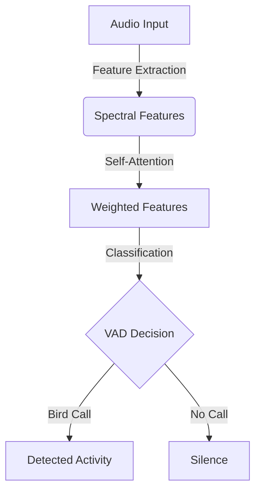

# TurboVAD

**TurboVAD** is a **lightweight, high-speed** Voice Activity Detection (VAD) system that utilizes **self-attention** and **spectral features** for accurate voice detection. Designed for real-time applications, TurboVAD achieves **high efficiency and accuracy**, making it ideal for **low-latency** environments.

## 🚀 Features
- **Self-Attention Mechanism** for efficient feature weighting.
- **Spectral Feature Analysis** including spectral centroid, entropy, flatness, and harmonic noise ratio.
- **Optimized C Implementation** for performance and efficiency.
- **Model Size < 1KB**, making it ideal for memory-constrained applications.
- **Fine-tuned for Bird Activity Detection** to enhance avian vocalization analysis.

## 📌 Technical Overview
TurboVAD processes **8 spectral features** extracted from audio signals:
1. Spectral Centroid
2. Spectral Entropy
3. Spectral Flatness
4. Harmonic Noise Ratio
5. Spectral Centroid SD
6. Spectral Entropy SD
7. Spectral Flatness SD
8. Harmonic Noise Ratio SD

These features represent **mean (μ) and standard deviation (σ)** over a time frame, providing robust temporal characteristics for accurate classification.

These features are processed using a **self-attention mechanism**, which assigns dynamic importance to each feature and refines classification using a softmax-based scoring system. The model is **specifically optimized for bird activity detection**, making it ideal for wildlife monitoring and ornithological research.

## ⚡ Model Architecture
- **Feature Extraction:** Precomputed spectral statistics.
- **Attention Mechanism:** Weights important features using learned attention matrices.
- **Classification:** A lightweight decision function with a sigmoid activation to determine voice presence.

### 🏗 Diagram Overview


## 🛠️ Installation & Usage
```bash
# Clone the repository
git clone https://github.com/yourusername/TurboVAD.git
cd TurboVAD

# Compile the C implementation
gcc -O2 -o turbo_vad src/turbo_vad.c -lm

# Run inference on sample input
./turbo_vad sample_audio.wav
```

## 🎯 Performance Metrics
| Metric              | Value  |
|--------------------|--------|
| Accuracy          | 79%    |
| Model Size       | < 1KB  |
| Optimal Threshold | 0.5002 |

## 🛠️ Input Parameters
TurboVAD accepts the following parameters:
- **filename:** Path to the input audio file.
- **window_size_det:** Window size for detection.
- **window_size_img:** Window size for image processing.
- **hop_size_det:** Hop size for detection.
- **hop_size_img:** Hop size for image processing.
- **window_type_det:** Window function type for detection.
- **window_type_img:** Window function type for image processing.
- **seg_len:** Segment length.
- **num_mel:** Number of Mel filterbanks.
- **mel_min:** Minimum Mel frequency.
- **mel_max:** Maximum Mel frequency.
- **wav_fol:** Path to the waveform folder.
- **stft_fol:** Path to the STFT cache folder.
- **mel_fol:** Path to the Mel spectrogram cache folder.
- **cache_fol:** Path to the cache folder.
- **cs_stft:** Cache size for STFT computations (color scheme for visualization).
- **cs_mel:** Cache size for Mel computations (color scheme for visualization).
- **th:** Audio filtration threshold. If set to `0`, the STFT is filtered dynamically to remove noise.

## 🛠️ Future Improvements
- Further fine-tuning for different bird species.
- Expansion to support multi-environment bird call detection.
- Optimizations for low-power embedded devices.
- Benchmarking against traditional VAD systems.

## 🤝 Contributing
Contributions are welcome! Feel free to open issues, submit PRs, or discuss improvements in the repo.

## 💜 License
**TurboVAD** is open-source under the **MIT License**.

---

🎧 **TurboVAD** – Powering **real-time, ultra-fast bird activity detection** with self-attention! 🚀
