# TurboVAD

**TurboVAD** is a **lightweight, high-speed** Voice Activity Detection (VAD) system that utilizes **self-attention** and **spectral features** for accurate voice detection. Designed for real-time applications, TurboVAD achieves **high efficiency and accuracy**, making it ideal for **low-latency** environments.

> **Note:** This project is currently **under testing**. The initial benchmark results are based on a **small sample size** and may vary as further testing and fine-tuning are performed.

## 🚀 Features
* **Self-Attention Mechanism** for efficient feature weighting
* **Spectral Feature Analysis** including spectral centroid, entropy, flatness, and harmonic noise ratio
* **Optimized C Implementation** for performance and efficiency
* **Model Size < 1KB**, making it ideal for memory-constrained applications
* **Fine-tuned for Bird Activity Detection** to enhance avian vocalization analysis
* **Highly optimized build system** with extensive compiler optimizations and SIMD support
* **Ultra-fast processing** at ~1198x faster than real-time

## 📌 Technical Overview

TurboVAD processes **8 spectral-temporal features**:
1. Spectral Centroid (μ + σ)
2. Spectral Entropy (μ + σ)
3. Spectral Flatness (μ + σ)
4. Harmonic Noise Ratio (μ + σ)

These features represent **mean (μ) and standard deviation (σ)** over a time frame, providing robust temporal characteristics for accurate classification.

These features are processed using a **self-attention mechanism**, which assigns dynamic importance to each feature and refines classification using a softmax-based scoring system. The model is **specifically optimized for bird activity detection**, making it ideal for wildlife monitoring and ornithological research.

# TurboVAD Architecture Documentation

## 🧠 Model Architecture

```mermaid
%%{init: {'theme': 'base', 'themeVariables': { 'fontSize': '12px'}}}%%
graph TD
    A["Input Features<br/>μ1-4, σ1-4"] --> B[Mu Branch]
    A --> C[Sigma Branch]
    B --> D["Dot Product<br/>W_mu[4×4]"]
    C --> E["Dot Product<br/>W_sigma[4×4]"]
    D --> F[Softmax]
    E --> G[Softmax]
    F --> H["Linear Comb.<br/>Classifier_mu[4]"]
    G --> I["Linear Comb.<br/>Classifier_sigma[4]"]
    H --> J[Mu Score]
    I --> K[Sigma Score]
    J --> L["Weighted Sum<br/>factors=[-11.0, 6.18]"]
    K --> L
    L --> M["Sigmoid<br/>threshold=0.5002"]
    M --> N{Prediction<br/>0/1}

    classDef feature fill:#f8bbd0,stroke:#c2185b;
    classDef weights fill:#e1bee7,stroke:#8e24aa;
    classDef math fill:#c5cae9,stroke:#3949ab;
    classDef output fill:#b2dfdb,stroke:#00796b;
    classDef decision fill:#ffcc80,stroke:#f57c00;
    
    class A feature;
    class D,E weights;
    class F,G,H,I math;
    class J,K,L,M output;
    class N decision;
```



## Attention Mechanism Specification

### Dual-Branch Architecture

- **Mu Branch (μ):** Processes mean spectral features; output: temporal stability of feature averages.
- **Sigma Branch (σ):** Analyzes feature variations; output: detection of transient patterns.

### Computational Stages

1. **Feature Projection:** 8D input to 8D attention scores via 2x4x4 matrix multiplication.
2. **Softmax Normalization:** Applies numerically stable softmax to score vectors.
3. **Classification Heads:** Linear combination with 4-element classifier weights for each branch.
4. **Decision Fusion:** 
   - Formula: \(-11.003 \times \mu + 6.180 \times \sigma\)
   - Sigmoid activation and threshold 0.5002 for classification.

### Optimization Features

- **Inference Time Optimization:**
   - Cache-local weight access, branchless computation, compiler auto-vectorization (AVX2).
- **Memory Safety:** Stack-allocated intermediates, no heap allocations in the prediction path.

## Data Processing Pipeline


## Pipeline Stages

**Input Handling:**

* **Audio Detection:** Auto-detects MP3/WAV using file headers
    ```c
    audio_data audio = auto_detect(filename);
    ```
* **Decoding:**
    * MP3: SIMD-accelerated via libmpg123
    * WAV: Direct memory mapping

**Spectral Analysis:**

* **STFT Parameters:**
    ```c
    stft_d stft = stft(&audio, window_size_det, hop_size_det, ...);
    ```
* **Dual window sizes:**
    * Detection: Optimal for model (default 2048 samples)
    * Imaging: Visual quality (default 4096 samples)
* **Feature Extraction:** Computes 8 features (4μ + 4σ) per 50ms segment
    ```c
    #pragma omp parallel for
    ```

**Output Generation:**

* **Conditional Saving:**
    ```c
    if(pred.val > 0.5002) {
        save_wav_segment(...);
        save_spectrogram(...);
    }
    ```


**Technical Highlights:**

| Aspect              | Implementation Detail              |
| :------------------ | :--------------------------------- |
| Memory Efficiency   | <1KB model weights, stack allocation |
| Parallelism         | 3.19x speedup on 6-core Ryzen      |
| Numerical Stability | Safe division, softmax with max-sub  |
| Reproducibility     | FFTW wisdom caching               |
| Portability         | Single-precision floats throughout   |


Dual-window architecture enables:

* Small windows (50ms) for detection latency
* Large windows (100ms+) for visual quality
* Zero-copy data sharing between stages


## 📊 Benchmark Results


> **Note:** The benchmark results presented here are from initial tests using a small sample size. Further testing and benchmarking are required to refine the performance metrics.


### Processing Pipeline Breakdown

### Performance Comparison: Segment Size Optimization
| **Metric**               | **0.5s Segments**        | **50ms Segments** 🚀      | **Improvement**        |
|--------------------------|--------------------------|---------------------------|------------------------|
| **Processing Speed**     | ~1,198× real-time        | ~13,889× real-time        | **11.6× faster**       |
| **Total Processing Time**| 0.834 ms/audio-sec       | 0.072 ms/audio-sec        | **11.6× reduction**    |
| **Model Inference Time** | 87.686 ns/audio-sec      | 65.711 ns/audio-sec       | **25.1% faster**       |
| **STFT**                 | 0.392 ms                 | 27 µs (0.027 ms)          | **14.5× faster**       |
| **Normalization**        | 69.408 µs                | 8.177 µs                  | **8.5× faster**        |
| **Feature Extraction**   | 372.793 µs               | 36.843 µs                 | **10.1× faster**       |
| **System IPC**           | 0.229                    | 0.759                     | **3.3× better**        |
| **Branch Miss Rate**     | 1.49%                    | 1.99%                     | 33.6% increase 📉      |
| **Parallel Speedup**     | 7.96×                    | 3.31×                     | 58.4% reduction 📉     |
| **CPUs Utilized**        | 8.31                     | 4.30                      | 48.3% reduction 📉     |

**Key Observations**:
- 🚀 **14.5× faster STFT** from improved cache locality
- 📉 **Parallel efficiency tradeoff** due to increased I/O-bound workload
- ⚡ **3.3× better IPC** shows improved instruction throughput
- 🔄 **Branch prediction** slightly impacted by finer segmentation

> **Note:** The reduced parallel speedup and CPU utilization reflect increased I/O dominance at smaller segment sizes - a common tradeoff in real-time systems.

### Current Performance Metrics (50ms Segments)
| Metric | Value |
|--------|-------|
| Accuracy | 79% |
| Model Size | < 1KB |
| Optimal Threshold | 0.5002 | 
| Processing Speed | ~13,889× real-time |
| Total Processing Time | 0.072 ms/audio-sec |

The benchmarks were generated using random sampling across diverse bird species, with results averaged over multiple samples to ensure representative performance metrics. All timings are normalized per second of audio for consistent comparison.

## 🛠️ Build System
TurboVAD employs a comprehensive build system with multiple optimization levels:

```bash
# Build with built-in color scheme (default)
make builtin

# Build with OpenCV-like color scheme
make opencv_like

# Build in debug mode 
make debug

# Clean build artifacts
make clean

# Run the program
make run

# Run with memory checking
make run_debug
```

### Build Features
* **Advanced Optimization** with `-Ofast` for maximum performance
* **SIMD Acceleration** with AVX, AVX2, FMA, and SSE4.2 instruction sets
* **Parallel Processing** via OpenMP (achieving ~8x parallel speedup)
* **Link-Time Optimization** for cross-file optimizations
* **Vectorization** of loops for improved performance
* **Aggressive loop optimizations** including unrolling, peeling, and interchange

## 🛠️ Input Parameters
TurboVAD accepts the following parameters:
* **filename:** Path to the input audio file
* **window_size_det:** Window size for detection
* **window_size_img:** Window size for output stft/mel spectrogram 
* **hop_size_det:** Hop size for detection
* **hop_size_img:** Hop size for output stft/mel spectrogram 
* **window_type_det:** Window function type for detection
* **window_type_img:** Window function type for output stft/mel spectrogram 
* **seg_len:** Segment length
* **num_mel:** Number of Mel filterbanks
* **mel_min:** Minimum Mel frequency
* **mel_max:** Maximum Mel frequency
* **wav_fol:** Path to the waveform folder
* **stft_fol:** Path to the STFT cache folder
* **mel_fol:** Path to the Mel spectrogram cache folder
* **cache_fol:** Path to the FFT cache folder
* **cs_stft:** Color scheme ID for visualization output STFT
* **cs_mel:** Color scheme ID for visualization output Mel Spectrogram
* **th:** Audio filtration threshold. If set to `0`, the STFT is filtered dynamically to remove noise. It is recommended that the default value for noisy data be 0.01

## 🛠️ Future Improvements
* Further fine-tuning for different bird species
* Expansion to support multi-environment bird call detection
* Optimizations for low-power embedded devices
* Benchmarking against traditional VAD systems

## 🤝 Contributing
Contributions are welcome! Feel free to open issues, submit PRs, or discuss improvements in the repo.

## 💜 License
**TurboVAD** is open-source under the **MIT License**.

## About
Spectral Feature Based Voice Activity Detection using Self Attention
